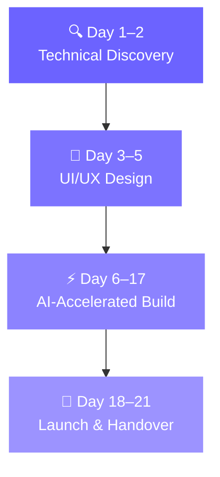

<!-- ✅ WORKING: Capsule Render Animated Header -->

<!-- ✅ WORKING: Typing SVG via readme-typing-svg (use herokuapp mirror which GitHub allows) -->

 

<!-- Badges Row -->

---

<!-- About Section -->

## 👋 Who We Are

**SlashEasy** is a battle-tested AI-Powered MVP Studio helping founders across **North America, Europe, the Middle East, Asia-Pacific, and India** go from blank Figma to live product in under **3 weeks**.

- 🚀 **80+ digital products** shipped across 5 continents
- ⚡ **2–3 weeks** average delivery time (vs 3–6 months at big agencies)
- 🏆 **Top Rated Plus** on Upwork — 100% Job Success Score
- 💰 **$200K+** earned on Upwork · 5.0★ across all reviews
- 🌍 Trusted by startups in **15+ industries**

 

---

## 🛠️ What We Build

| 🚀 MVP Development | 🌐 Web Development | 📱 Mobile Apps | 🔬 POC / Validation |
|:---:|:---:|:---:|:---:|
| Market-ready MVPs in 2–3 weeks. AI-powered, no corners cut. | SaaS dashboards, full-stack platforms built to scale. | High-performance iOS & Android. Clean code, day one. | Validate your riskiest assumptions before full budget. |

---

## ⚙️ Technology Stack

<!-- Animated Tech Badges -->

---
## 🏗️ Our 4-Phase Build Process

